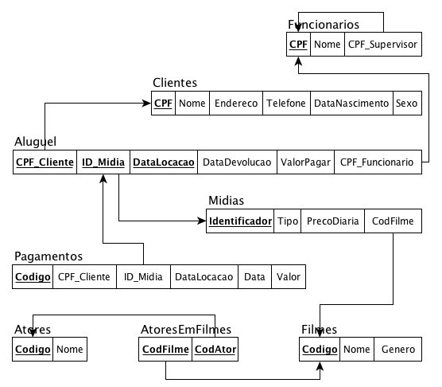

# Armazenamento e Organização de Dado

Apresentar a blocagem (fator de bloco), o número de blocos necessários para armazenar o arquivo, o espaço desperdiçado por bloco em cada arquivo e o espaço total gasto para armazenar cada arquivo (tabela) presente no modelo relacional abaixo.

Considere que o tamanho de bloco de disco é de 2KB, que os arquivos possuem registros de tamanho fixo, não espalhados e que eles têm a seguinte configuração de número de registros e tamanhos de campos:

Atores (10.000 registros) → Codigo (16B), Nome (160B) 
Clientes (100.000 registros) → CPF (11B), Nome (160B), Endereco (200B), Telefone (16B), DataNascimento (12B), Sexo (1B) 
Filmes (2.000.000 registros) → Codigo (16B), Nome (160B), Genero (80B) 
Funcionarios (3.500 registros) → CPF (11B), Nome (160B) 
Midias (10.000.000 registros) → Identificador (24B), Tipo (8B), PrecoDiaria (24B) 
Aluguel (20.000.000 registros) → DataLocacao (12B), DataDevolucao (10B), ValorPagar (24B) 
Pagamentos (50.000.000 registros) → Codigo (48B), Data (12B), Valor (24B) 
AtoresEmFilmes (1.000.000 registros) 
Observem a existência de chaves estrangeiras que obviamente devem ser consideradas como campos integrantes dos arquivos.
